# Heritage Housing Issues


## Click [here](https://heritage-houses.herokuapp.com/) to live site.  

---

In this project, I've built a Data App with a Machine Learning User Interface (UI) combining: (1) Python packages for Machine Learning, Data Analysis and Data Visualization; and (2) Streamlit for fast Machine Learning prototyping. This project was created for my last milestone Project at Code Institute to showcase my knowledge to perform critical data analysis to generate valuable insights and deliver data-driven recommendations.

The project immerses you into an environment that fully reflects professional business requirements. It achieves this by encouraging you to reflect on the "whys" and the "hows" of a Machine Learning system that delivers tangible value to your organization. The UI and the data analysis are conducted in a way that aligns with the business requirements.

---
# Table of Contents
<details>
<summary>Table of Contents</summary>

* [Dataset Content](#dataset-content)
* [User Stories](#user-stories)
* [Business Requirements](#business-requirements)
* [Hypothesis and how to validate?](#hypothesis-and-how-to-validate?)
    * [Hypothesis One](#hypothesis-one)
    * [Hypothesis Two](#hypothesis-two)
    * [Hypothesis Two](#hypothesis-three)
* [Rationale to map the business requirements to the Data Visualizations and ML tasks](#rationale-to-map-the-business-requirements-to-the-data-visualizations-and-ml-tasks) 
    * [Business Requirement 1: Data Visualization and Correlation Study](#business-requirement-1:-data-visualization-and-correlation-study)
    * [Business Requirement 2: Classification, Regression, Cluster, Data Analysis](#business-requirement-2:-classification,-regression,-cluster,-data-analysis)
* [ML Business Case](#ml-business-case)
* [Dashboard Design](#dashboard-design)
    * [Pge 1](#page-1)
    * [Pge 2](#page-2) 
    * [Pge 3](#page-3)
    * [Pge 4](#page-4)
    * [Pge 5](#page-5)
    * [Pge 6](#page-6)
    * [Pge 7](#page-7)
* [Bugs](#bugs)
* [Deployment](#deployment) 
    * [Using Github & Gitpod](#using-github-&-gitpod)
    * [Forking the GitHub Repository](#forking-the-gitHub-repository) 
    * [Making a Local Clone](#making-a-local-clone) 
    * [Deployment To Heroku](#deployment-to-heroku) 
* [Main Data Analysis and Machine Learning Libraries](#main-data-analysis-and-machine-learning-libraries) 
* [Credits](#credits)
    * [Online resources](#online-resources)
    * [Tutorials and inspiration](#tutorials-and-inspiration) 
    * [People](#people)  
</details>
<hr>

---

## Dataset Content
* The dataset is sourced from [Kaggle](https://www.kaggle.com/codeinstitute/housing-prices-data). We created then a fictitious user story where predictive analytics can be applied in a real project in the workplace. 
* The dataset has almost 1.5 thousand rows and represents housing records from Ames, Iowa; indicating house profile (Floor Area, Basement, Garage, Kitchen, Lot, Porch, Wood Deck, Year Built) and its respective sale price for houses built between 1872 and 2010.

|Variable|Meaning|Units|
|:----|:----|:----|
|1stFlrSF|First Floor square feet|334 - 4692|
|2ndFlrSF|Second floor square feet|0 - 2065|
|BedroomAbvGr|Bedrooms above grade (does NOT include basement bedrooms)|0 - 8|
|BsmtExposure|Refers to walkout or garden level walls|Gd: Good Exposure; Av: Average Exposure; Mn: Mimimum Exposure; No: No Exposure; None: No Basement|
|BsmtFinType1|Rating of basement finished area|GLQ: Good Living Quarters; ALQ: Average Living Quarters; BLQ: Below Average Living Quarters; Rec: Average Rec Room; LwQ: Low Quality; Unf: Unfinshed; None: No Basement|
|BsmtFinSF1|Type 1 finished square feet|0 - 5644|
|BsmtUnfSF|Unfinished square feet of basement area|0 - 2336|
|TotalBsmtSF|Total square feet of basement area|0 - 6110|
|GarageArea|Size of garage in square feet|0 - 1418|
|GarageFinish|Interior finish of the garage|Fin: Finished; RFn: Rough Finished; Unf: Unfinished; None: No Garage|
|GarageYrBlt|Year garage was built|1900 - 2010|
|GrLivArea|Above grade (ground) living area square feet|334 - 5642|
|KitchenQual|Kitchen quality|Ex: Excellent; Gd: Good; TA: Typical/Average; Fa: Fair; Po: Poor|
|LotArea| Lot size in square feet|1300 - 215245|
|LotFrontage| Linear feet of street connected to property|21 - 313|
|MasVnrArea|Masonry veneer area in square feet|0 - 1600|
|EnclosedPorch|Enclosed porch area in square feet|0 - 286|
|OpenPorchSF|Open porch area in square feet|0 - 547|
|OverallCond|Rates the overall condition of the house|10: Very Excellent; 9: Excellent; 8: Very Good; 7: Good; 6: Above Average; 5: Average; 4: Below Average; 3: Fair; 2: Poor; 1: Very Poor|
|OverallQual|Rates the overall material and finish of the house|10: Very Excellent; 9: Excellent; 8: Very Good; 7: Good; 6: Above Average; 5: Average; 4: Below Average; 3: Fair; 2: Poor; 1: Very Poor|
|WoodDeckSF|Wood deck area in square feet|0 - 736|
|YearBuilt|Original construction date|1872 - 2010|
|YearRemodAdd|Remodel date (same as construction date if no remodeling or additions)|1950 - 2010|
|SalePrice|Sale Price|34900 - 755000|

---

## User Stories

### User Stories that have been satisfied by creation of particular apps in this project:

| id  |  Content | How was it satisfied | User
| ------ | ------ | ------ | ------ |
|  [#1](https://github.com/van-essa/heritage-housing-issues/issues/1) |As a user, I want to understand the components of the sale price rise of the housing market in Iowa. | Dashboad | Client |
|  [#2](https://github.com/van-essa/heritage-housing-issues/issues/2) | Get an stimate value of heritage houses. | Dashboad | Client |
|  [#3](https://github.com/van-essa/heritage-housing-issues/issues/3) | As a user, I want to get all the information requested on a user-friendly dashboard so I can explore and understand the data easily. | Dashboad | Client |
|  [#4](https://github.com/van-essa/heritage-housing-issues/issues/4) | As a user, I want to visualise the cases used for data preparation and ML pipelines so that an understanding of their usage is well communicated. | Dashboad | Data Scientist |

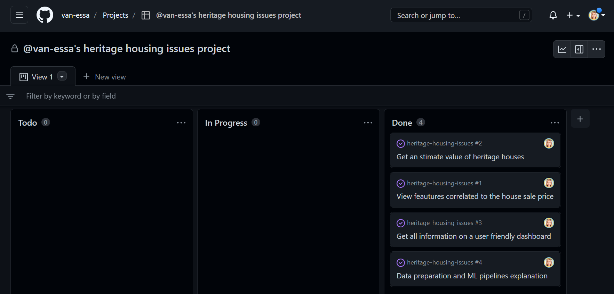

---


## Business Requirements
As a good friend, you are requested by your friend, who has received an inheritance from a deceased great-grandfather located in Ames, Iowa, to  help in maximizing the sales price for the inherited properties.

Although your friend has an excellent understanding of property prices in her own state and residential area, she fears that basing her estimates for property worth on her current knowledge might lead to inaccurate appraisals. What makes a house desirable and valuable where she comes from might not be the same in Ames, Iowa. She found a public dataset with house prices for Ames, Iowa, and will provide you with that

* 1 - The client is interested in discovering how the house attributes correlate with the sale price. Therefore, the client expects data visualizations of the correlated variables against the sale price to show that.
* 2 - The client is interested to predict the house sales price from her 4 inherited houses, and any other house in Ames, Iowa.

---

## Hypothesis and how to validate?
### Hypothesis One
Suspect houses with larger square footing may have had a higher sales price.
* A Correlation study can help in this investigation.
### Hypothesis Two
Suspect that between houses with similar `square footing`, those with a more recent `Year Built` date may have had a higher `sales price`.
* A Correlation study can help in this investigation.
### Hypothesis Three
Suspect that between houses with similar `square footing` and `year built` date, those with a more recent `Remodel` date may have had a higher `sales price`.
* A Correlation study can help in this investigation.
### Hypothesis Four
Suspect that between houses with similar `square footing`,  those with higher `quality` and `condition` scores may have had a higher `sales price`.
* A Correlation study can help in this investigation.


---

## Rationale to map the business requirements to the Data Visualizations and ML tasks
* ### Business Requirement 1: Data Visualization and Correlation Study
    - We will inspect the data related to the houses.
    - We will conduct a correlation study (Pearson and Spearman) to understand better how the variables are correlated to Sale Price.
    - We will plot the main variables against Sale Price to visualize insights.

    - As a client, I want to inspect the data related to the house records to discover how the house attributes correlate with the sale price.
    - As a client, I want to conduct a correlation study(Pearson and Spearman) to understand better how the variables are correlated to Sale Price so that I can discover how the house attributes correlate with the sale price.
    - As a client, I want to plot the main variables against the Sale Price to Visualize insights, so I can discover how the house attributes correlate with the Sale Price.

* ### Business Requirement 2: Classification, Regression, Cluster, Data Analysis
    - We want to predict the value of a house. We want to build a regression model to predict the dependent variable.
    - We want to make plots to visualize the train and test sets predictions vs the actual.
    - We want to run regression evaluation to demonstrate the R2 Score and Mean Absolute Error.
    
    - As a client, I want to predict the Sale Price for a given house. We want to build an ML Model so the client can predict the house Sales Price from her four inherited dwellings and any other home in Ames, Iowa. 
    - As a client, want to build a regression model or change the ML task to classification depending on the regressor performance.

---


## ML Business Case
### Predict Sale Price
#### Regression Model 
* We want an ML model to predict the sale price of a house. A target variable is a serial number. We consider a **regression model**, which is supervised and uni-dimensional.
* Our ideal outcome is to provide our client with reliable insight into what sale price she should expect for her inherited houses.
* The model success metrics are
  - At least 0.7 for R2 score, on train and test set
* The ML model is considered a failure if:
   - After 12 months of usage, the model's predictions are 50% off more than 30% of the time. Say a prediction is >50% off if predicted ten months and the actual value was two months.
* The output should be a constant value for the **`sale price`**.

---


## Dashboard Design

### Page 1 
### Quick project summary
* Project Terms & Jargon
* Describe Project Dataset
* State Business Requirements

The project terms & jargon, the description of the project's dataset and the business requirements are stated on the Project Summary page. Here the user can get an overview of the project and links to the readme file and the project's dataset collected from Kaggle.

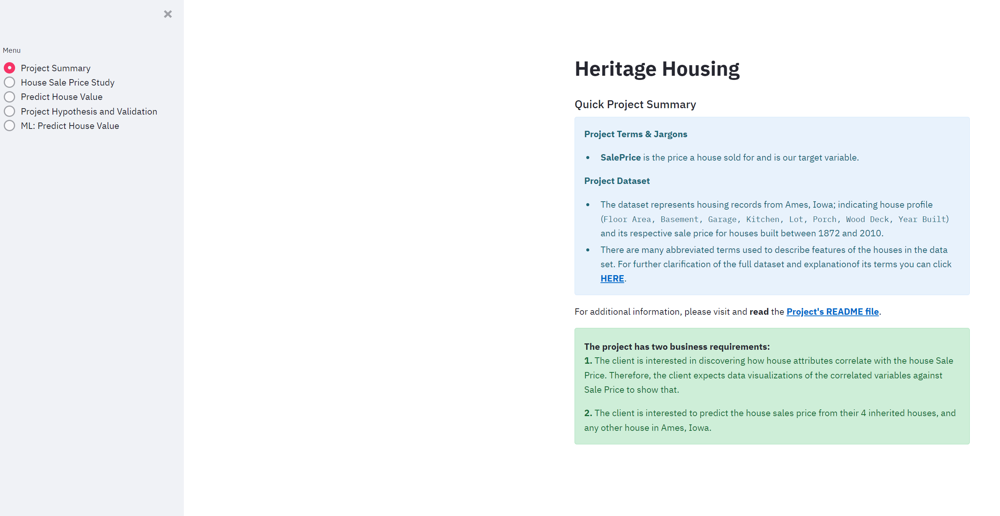


### Page 2
### Sale Price Study
* Before the analysis, we knew we wanted this page to answer business requirement 1, but we couldn't know in advance which plots would need to be displayed.
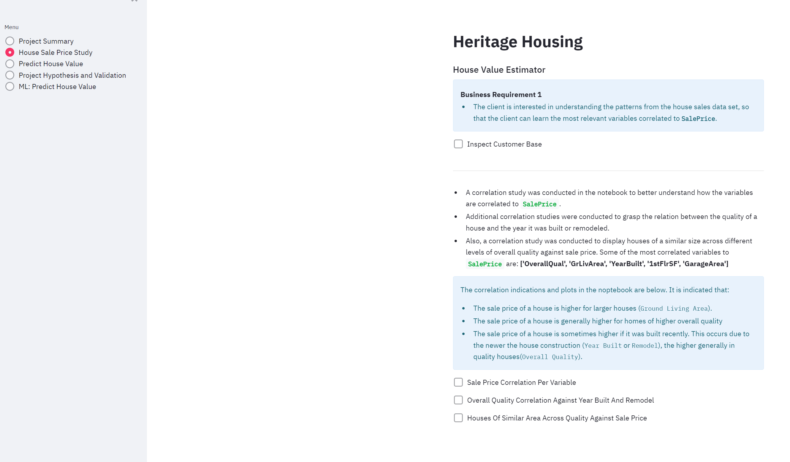

* After data analysis, we agreed with stakeholders that the page will: 
	* State business requirement 1
	* Checkbox: data inspection on house attributes (display the number of rows and columns in the data, and display the first ten rows of the data)
  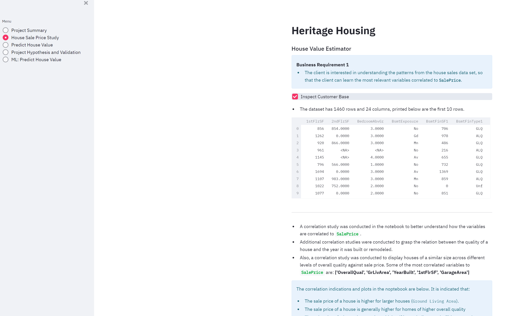
	* Display the most correlated variables to Sale Price and the conclusions
  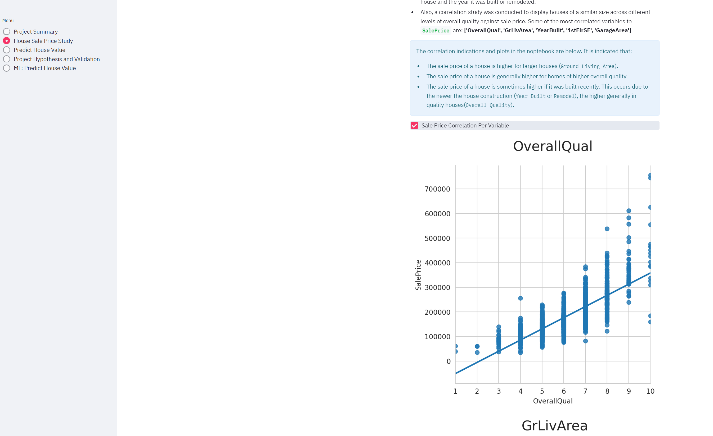
	* Checkbox: Individual plots showing the Sale Price levels for each correlated variable 
  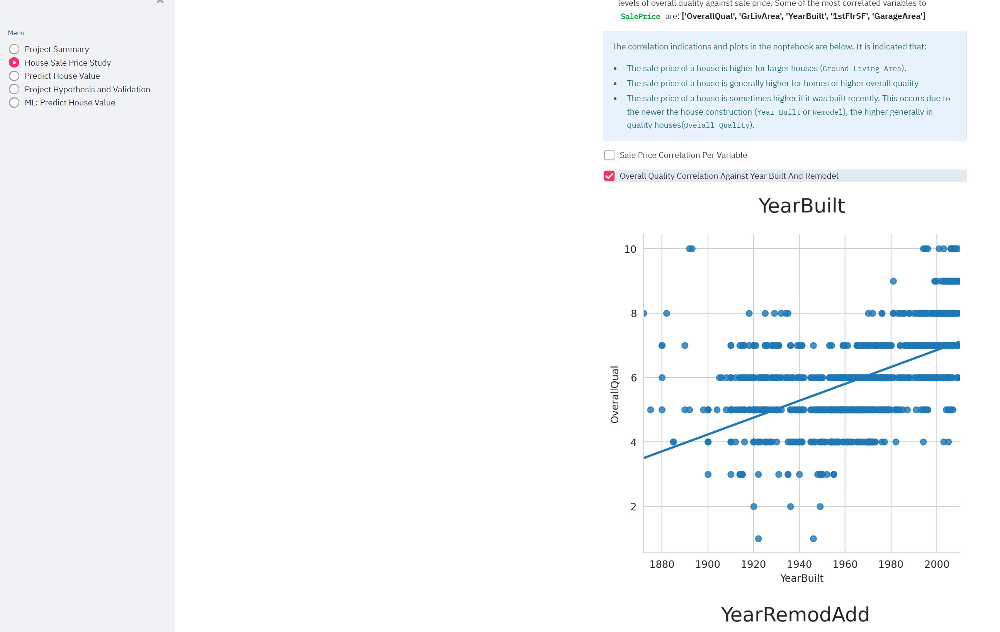
	* Checkbox: Parallel plot using Sale Price and correlated variables
  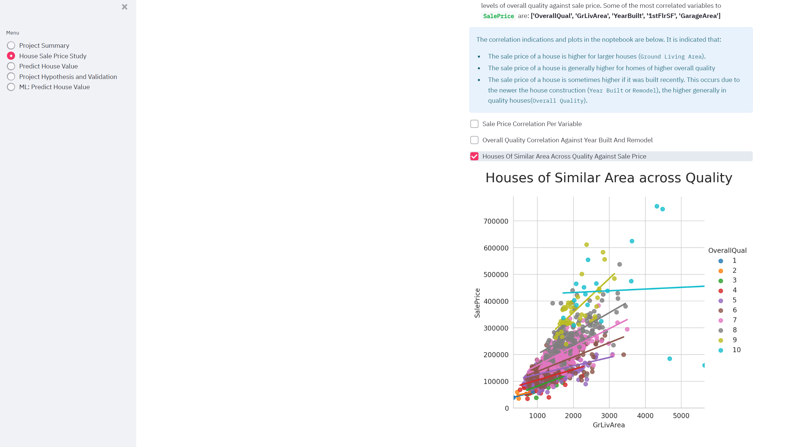

  

### Page 3
### House Price Estimator
* State business requirement 2
* Set of widgets inputs, which relates to the prospect profile. Each set of inputs is related to a given ML task to predict prospect Sale Price.
* Run predictive analysis" button that serves the prospect data to our ML pipelines, and predicts if the prospect will increase Sale Price or not, if so, when. For the Sale Price predictions, the page will inform the associated probability for Sale Price level.
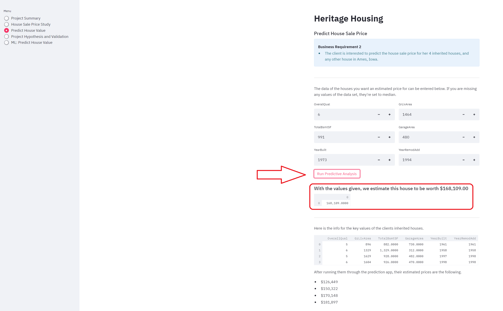


### Page 4
### Project Hypothesis and Validation
* Before the analysis, we knew we wanted this page to describe each project hypothesis, the conclusions, and how we validated each. After the data analysis, we can report that:

**1.** We suspect houses with vast `square footing` may have had a higher `sales price`: **Correct**.
- The correlation study on the **House Sale Price Study** supports that; there is a strong correlation between the two.

**2.** We suspect that between houses with similar `square footing`, those with a more recent `Year Built` date may have had a higher `sales price`: **Correct**.
- The correlation study on the **House Sale Price Study** supports that; 
 there is a moderate correlation between the two. Also noteworthy: houses with a more recent `Year Built` date are usually higher in `Overall Quality` which has stronger correlation to `Sale Price`.

**3.** We suspect that between houses with similar `square footing` and `year built` to date, those with a more recent `Remodel` date may have had a higher `sale price`: **Correct**.
 - The correlation study on the **House Sale Price Study** supports that; there is a weak to moderate correlation between the two. Also noteworthy: there is a relationship between houses with a more recent `Remodel` date being higher in `Overall Quality`.

**4.** We suspect that between houses with similar `square footing`, those with higher `quality and condition` scores may have had a higher `sales price`: **Correct**.
 - The correlation study on the **House Sale Price Study** supports that; there is a strong correlation between the two variables.

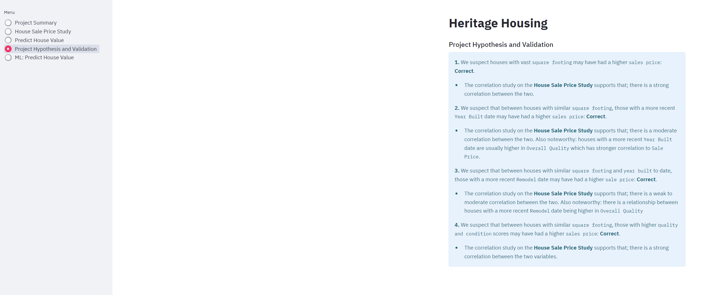


### Page 5
### Predict Sale Price
* Considerations and conclusions after the pipeline is trained
* Present ML pipeline steps
* Feature importance
* Pipeline performance
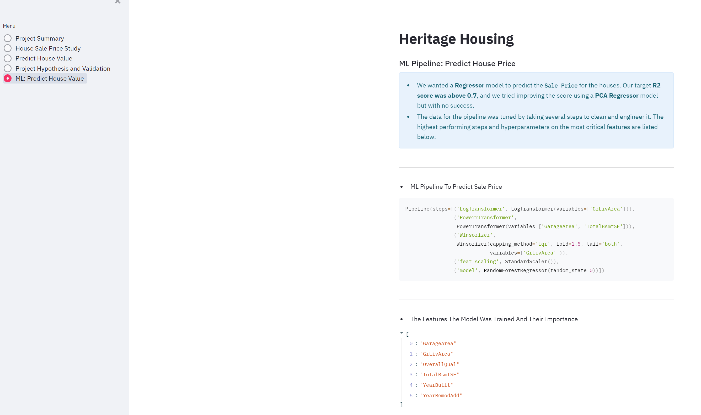
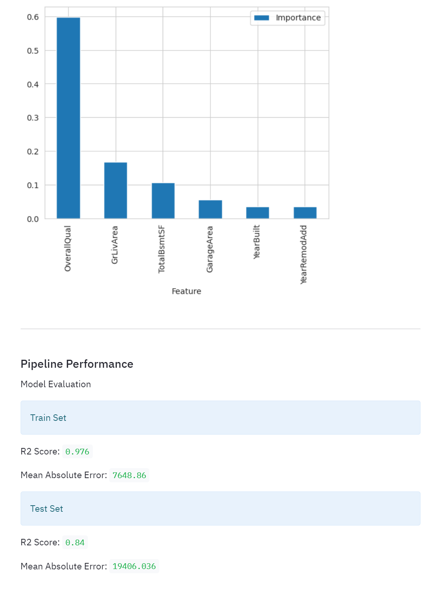

---

## Bugs
### **All estimators failed to fit**

When I worked on the Predict Sale Notebook and when I ran the GridSearch CV - Binary Classifier, namely:

 `from sklearn.metrics import make_scorer, recall_score
 search = HyperparameterOptimizationSearch(models=models_quick_search, params=params_quick_search)
 search.fit(X_train, y_train,
           scoring =  make_scorer(recall_score, pos_label=1),
           n_jobs=-1, cv=5)`

 and I got this error:

 `**NotFittedError: All estimators failed to fit**`

 The issue was that I blindly followed the Walkthrough 2 process and added two different Pipelines, one for data cleaning and one for Modeling. Instead, I should have feated everything in one Pipeline as I didn't need to handle target imbalance.


 ### **Grid Search CV**
 
 When I worked on the **Modeling, and Evaluation Notebook Predict Sale Price**, I ran the *Cleaning and Feature Engineer* function, but it didn't seem to clean the data. I was running the **Grid Search CV - Sklearn**, and I got this error:

 `ValueError: Classification metrics can't handle a mix of multiclass and continuous targets`

 and 

 `warnings.warn(
/workspace/.pip-modules/lib/python3.8/site-packages/sklearn/model_selection/_search.py:922: UserWarning: One or more of the test scores are non-finite: [nan]
 warnings.warn(`

 And when I checked the results, I got NaN values.

 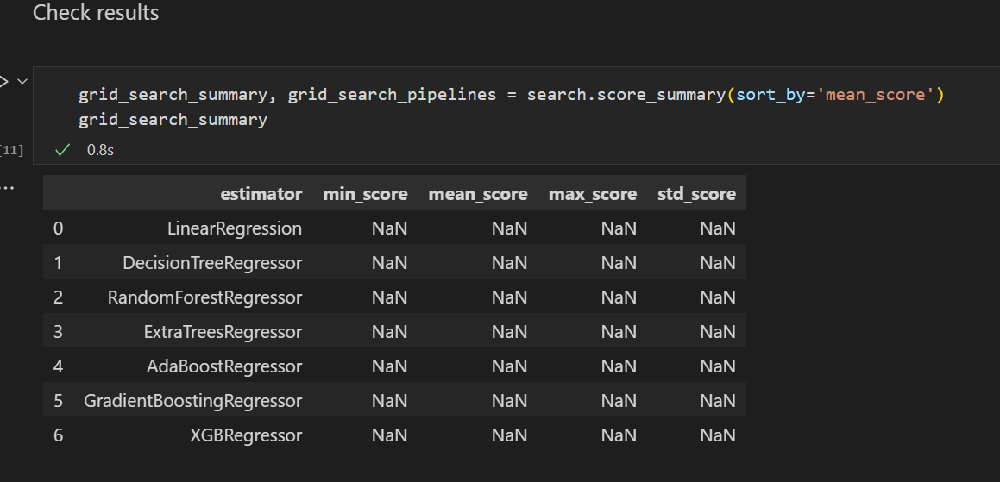

 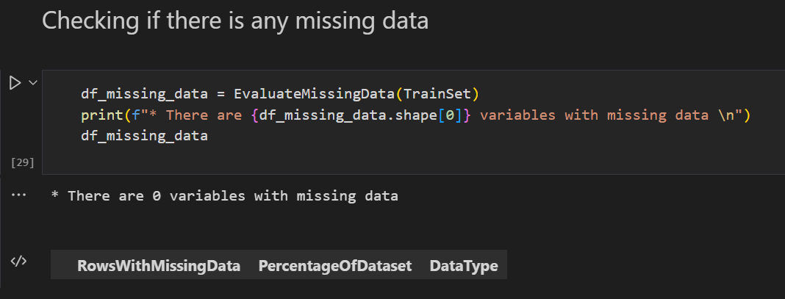

 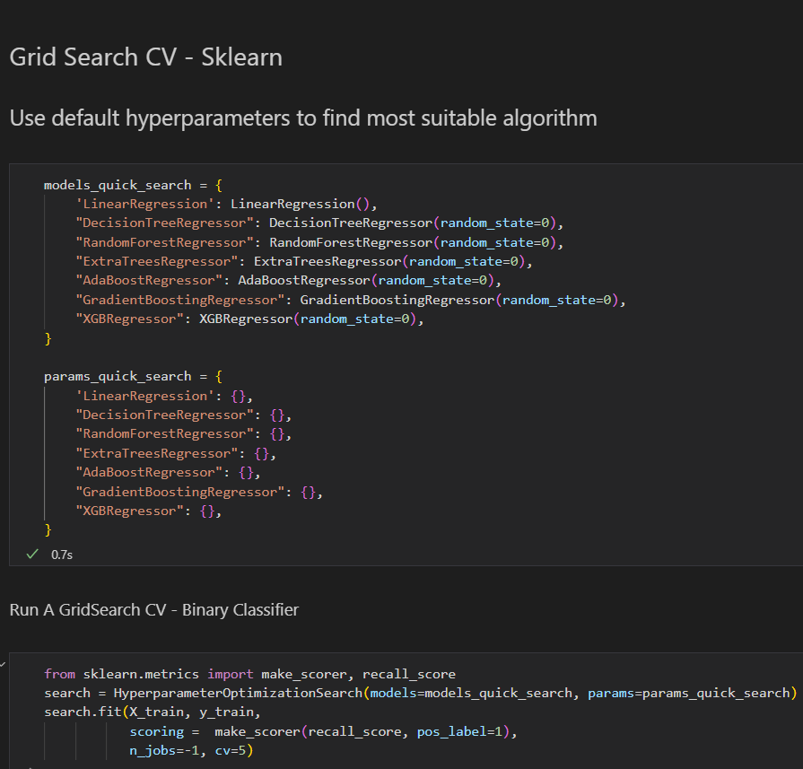


 The reason of this issue was that I added 

 `search.fit(X_train, y_train,
           scoring =  make_scorer(recall_score, pos_label=1),
           n_jobs=-1, cv=5)`

Instead of

`search.fit(X_train, y_train, scoring = 'r2', n_jobs=-1, cv=5)`

### **Assess Feature Importance**
When I worked on the **Modeling and Evaluation Notebook - Predict Sale**on the House Price Dataset, I ran the *Assess feature importance*, and I got the 

`AttributeError: 'numpy.ndarray' object has no attribute 'columns' error`

 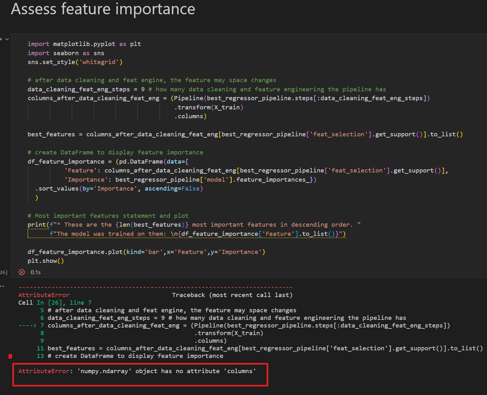

This issue was because I counted wrong my `data_cleaning_feat_eng_steps` value. When I added the correct number (8), the error didn't appear again. 

---

## Deployment

The master branch of this repository has been used for the deployed version of this application.

### Using Github & Gitpod

To deploy my Data application, I had to use the [Code Institute Full Template](https://github.com/Code-Institute-Solutions/milestone-project-heritage-housing-issues).

- Click the `Use This Template` button.
- Add a repository name and brief description.
- Click the `Create Repository from Template` to create your repository.
- To create a Gitpod workspace you then need to click `Gitpod`, this can take a few minutes.
- When you want to work on the project it is best to open the workspace from Gitpod (rather than Github) as this will open your previous workspace rather than creating a new one. You should pin the workspace so that it isn't deleted.
-  Committing your work should be done often and should have clear/explanatory messages, use the following commands to make your commits:
    - `git add .`: adds all modified files to a staging area
    - `git commit -m "A message explaining your commit"`: commits all changes to a local repository.
    - `git push`: pushes all your committed changes to your Github repository.

### Forking the GitHub Repository

By forking the GitHub Repository you will be able to make a copy of the original repository on your own GitHub account allowing you to view and/or make changes without affecting the original repository by using the following steps:

1. Log in to GitHub and locate the [GitHub Repository](repo here???)
2. At the top of the Repository (not top of page) just above the "Settings" button on the menu, locate the "Fork" button.
3. You should now have a copy of the original repository in your GitHub account.

### Making a Local Clone

1. Log in to GitHub and locate the [GitHub Repository](https://github.com/Code-Institute-Solutions/milestone-project-heritage-housing-issues)
2. Under the repository name, click "Clone or download".
3. To clone the repository using HTTPS, under "Clone with HTTPS", copy the link.
4. Open commandline interface on your computer
5. Change the current working directory to the location where you want the cloned directory to be made.
6. Type `git clone`, and then paste the URL you copied in Step 3.

```
$ git clone https://github.com/Code-Institute-Solutions/milestone-project-heritage-housing-issues
```

7. Press Enter. Your local clone will be created.

### Deployment To Heroku

* The App live link is: https://heritage-houses.herokuapp.com/ 
* The project was deployed to Heroku using the following steps.

1. Log in to Heroku and create an App
2. At the Deploy tab, select GitHub as the deployment method.
3. Select your repository name and click Search. Once it is found, click Connect.
4. Select the branch you want to deploy, then click Deploy Branch.
5. The deployment process should happen smoothly in case all deployment files are fully functional. Click now the button Open App on the top of the page to access your App.

---


## Main Data Analysis and Machine Learning Libraries

|Libraries Used In The Project|How I Used The Library|Link|
|:----|:----|:----|
|Numpy|Used to process arrays that store values and aka data|[Link](https://numpy.org/)|
|Pandas|Used for data analysis, data exploration, data manipulation,and data visualization|[Link](https://pandas.pydata.org/)|
|Matplotlib|Used for graphs and plots to visualize the data|[Link](https://matplotlib.org/)|
|Seaborn|Used to visualize the data in the Streamlit app with graphs and plots|[Link](https://seaborn.pydata.org/)|
|ML: feature-engine|Used for engineering the data for the pipeline|[Link](https://feature-engine.readthedocs.io/en/latest/)|
|ML: Scikit-learn|Used to creat the pipeline and apply algorithms, and feature engineering steps|[Link](https://scikit-learn.org/stable/)|
|Streamlit|Used for creating the app to visualize the project's study|[Link](https://streamlit.io/)|


### **Data Cleaning**
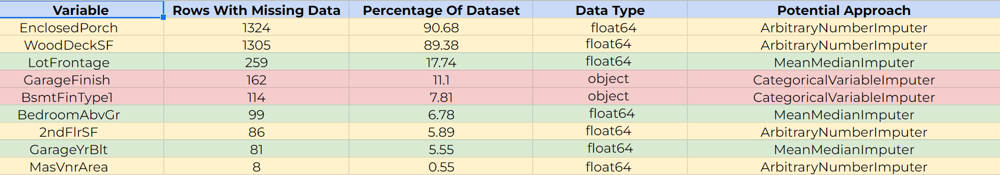
* #### `CategoricalVariableImputer`

  * In our Data Cleaning Notebook, `GarageFinish` showed little to no correlation against the sale price in our Sale Price Study Notebook study, and there is no clarity on its indicator. Thus, a decision was made to fill the missing data with `Unf`. 

  * Then, when running the PPS, we saw a moderate correlation between `GarageFinish`, `Overall Quality`, `YearBuilt` and other variables. We could predict what `GarageFinish` could be based on different variables to improve our model. We used the CategoricalVariableImputer function in our case as using the frequent category as our imputation method was easy to implement, a fast way of obtaining complete datasets and could be integrated into production (during model deployment). 

  * Also, the same strategy was followed with the `BsmtFinType1`; we filled in `Unf` for any missing data. When checking the missing values, all had `TotalBsmtSF`, and we didn't need to fill in any of the missing values with `None`.

* #### `ArbitraryNumberImputer`
  * The ArbitraryNumberImputer function replaced the missing data of `2ndFlrSF`, `EnclosedPorch`, `MasVnrArea` and `WoodDeckSF` with 0 as it was the most common value for all of these variables. Looking at`EnclosedPorch`, the missing data was 90.7%, and 7.9% of the data available was 0. Thus, more than 80% of the available data was 0. Hence, we used the `ArbitraryNumerImputer` to impute the mode value for each of these columns. 

  * Another option was to drop the columns since there were more than 80% missing data. Yet, in our case, the house size was one of the most significant predictors of `Sale Price`, and we wanted to investigate the PPS, namely if we would have got a better PPS by combining all the variables related to the house size once our data was cleaned. 


* #### `MeanMedianImputer`
  * MeanMedianImputer was used for `LotFrontage`, another variable related to the house, to attribute the NaN values with a median value. Using the ***Pandas Profile Report***, MeanMedianImputer was the chosen function due to the normal distribution we saw on our Sale Price Study Notebook. 

  * `MeanMedianImputer` was also used for `BedroomAbvGr`.

  * Last,  NaN values appear where a house didn't have a garage in the `GarageYrBlt`. Thus, `MeanMedianImputer` was added to this variable.

### **Feature Engineering**
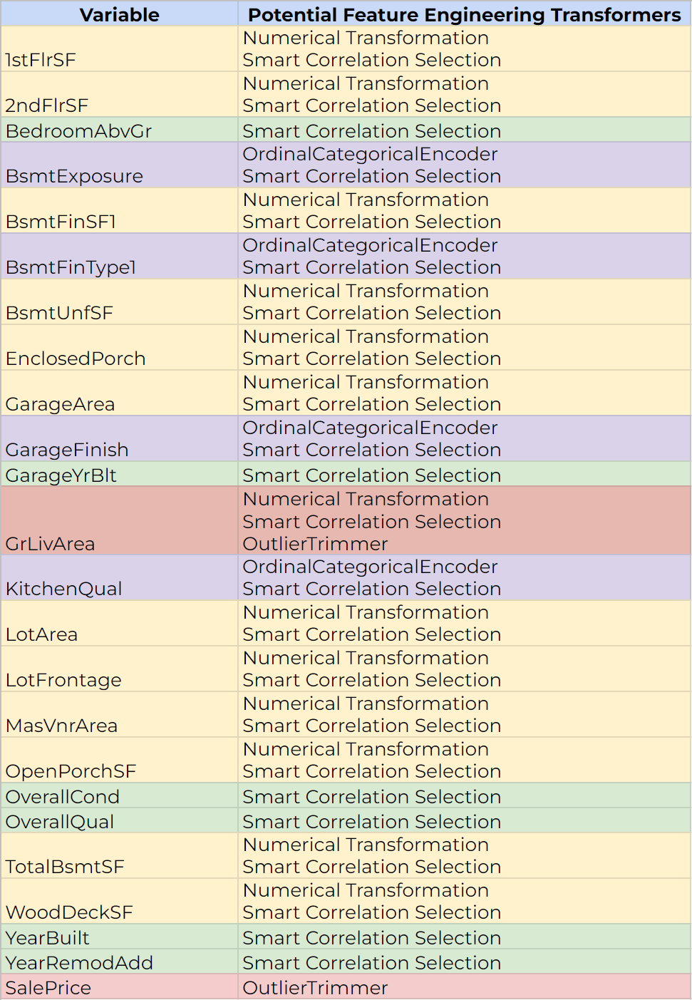
* `1stFlrSF` and `GrLivArea` seemed to perform well to the `log_e`, `box_cox` and `yeo_johnson` methods. `log_e` for these variables was used and trimmed them off the outliers. 
In the Sale Price Study (Notebook two), we noticed that some outliers had other vital outlier variables. For instance, some of the largest `GrLivArea` had very low `SalePrice` compared to the rest of the data, which could have been removed. Yet, removing these records from our data would've imbalanced our train and test sets since we first ran it through the cleaning pipeline. Thus `Feature Engine Windsoriser` was used, which was the transformation of statistics by limiting extreme values in the statistical data to reduce the effect of possibly spurious outliers.

* For `2ndFlrSF`, `BsmtFinSF1`, `BsmtUnfSF`, `GarageArea`, `MasVnrArea`, `OpenPorchSF`, `TotalBsmtSF` and `WoodDeckSF`, `power` transformer was used as it kept the strong kurtosis that these variables carried with all their zeros whilst normalizing the rest of the data.

* `EnclosedPorch` doesn't had enough data that weren't zeros to justify using the `power` transformer.

* `LotArea` and `LotFrontage` contained a small number of zeros that were well adapted to `log_e` and `yeo_johnson`, so 'log_e'was used.

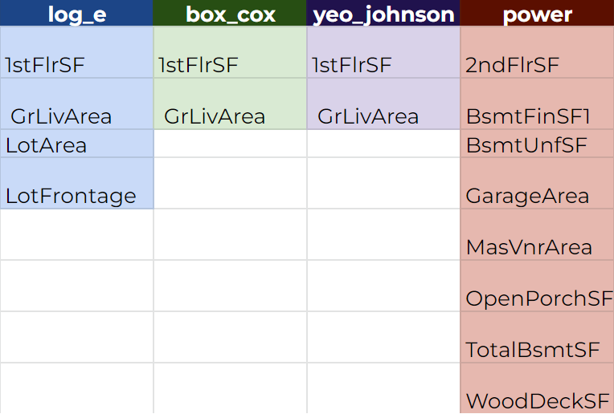

---

## Credits 

Throughout the process of building this website, various online sources have been used to help fix bugs & tackle problems, in addition to multiple modules to create the functionality of this website:

### Online resources
* Code Institute's learning material on [Predictive Analytics](https://codeinstitute.net/se/)
* [Kaggle](https://www.kaggle.com/datasets/codeinstitute/housing-prices-data) provided the dataset used in this project 
* John Ade-Ojo's blog post on the towardsdatascience online source regarding [creating a model to predict house prices](https://towardsdatascience.com/predicting-house-prices-with-machine-learning-62d5bcd0d68f)
* Exploratory Data Analysis of Iowa Housing Price Prediction Problem blop post from [Revathi Suriyadeepan](https://medium.com/analytics-vidhya/exploratory-data-analysis-of-iowa-housing-price-prediction-problem-3d50a016797a)
* Categorical encoding using Label-Encoding and One-Hot-Encoder from [Dinesh Yadav](https://towardsdatascience.com/categorical-encoding-using-label-encoding-and-one-hot-encoder-911ef77fb5bd)
* A Thorough Dive into the Ames Iowa Housing Dataset from Jesse Villines post on [Medium](https://medium.com/mlearning-ai/a-thorough-dive-into-the-ames-iowa-housing-dataset-part-4-of-4-e127321885da)
* Handling Missing Values with Iowa House Prices on Medium from [AMOL MODI](https://www.kaggle.com/code/amodi8/handling-missing-values-with-iowa-house-prices/notebook)
* Feature engineering - handling nan values from Medium on [Questions & Answers](https://www.kaggle.com/questions-and-answers/215252) section
* Feature Transformers: Hidden Gems from Jan Krepl on [Towards Data Science](https://towardsdatascience.com/feature-transformers-hidden-gems-917bc1237f90)
* Predicting House Prices with Linear Regression | Machine Learning from Scratch on 
Towards Data Science by [Venelin Valkov](https://towardsdatascience.com/predicting-house-prices-with-linear-regression-machine-learning-from-scratch-part-ii-47a0238aeac1)
* Housing Price Prediction (Linear Regression)on [Kaggle](https://www.kaggle.com/code/ashydv/housing-price-prediction-linear-regression)


### Tutorials and inspiration

* The walkthrough project 'Churnometer ' from Code Institute [videos](https://learn.codeinstitute.net/courses/course-v1:CodeInstitute+DDA101+2021_T4/courseware/bba260bd5cc14e998b0d7e9b305d50ec/c83c55ea9f6c4e11969591e1b99c6c35/)
* How to predict House Prices in Ames, Iowa | Kaggle Competition in Data Science & Machine Learning [YouTube Video](https://www.youtube.com/watch?v=VSeGseoJsNA&ab_channel=AlexanderHess-Pythonista) from Alexander Hess, PhD Student atWHU - Otto Beisheim School of Management, Vallendar, Germany 
* Using Streamlit to Visualize Data from the DataLakeHouse [YouTube Channel](https://www.youtube.com/watch?v=2Re_0qUGsAk&ab_channel=AICG)
* Streamlit app to predict Housing Prices in Ames, Iowa from Adhol [YouTube Video](https://www.youtube.com/watch?v=O6EiQ8UO0dk&ab_channel=AdhokshajaPradeep)


### People

* My partner for all his support throughout this time.
* Niel, developer and tutor lead on PP5 Predictive Analytics slack channel for helping me with all my questions for my project.
* Samuel Dainton, student at Code Institute, for his support and help on Slack for my questions during my studies and PP5.


